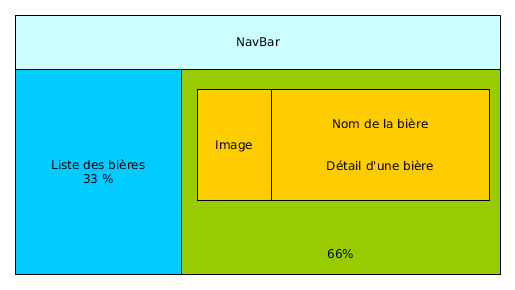
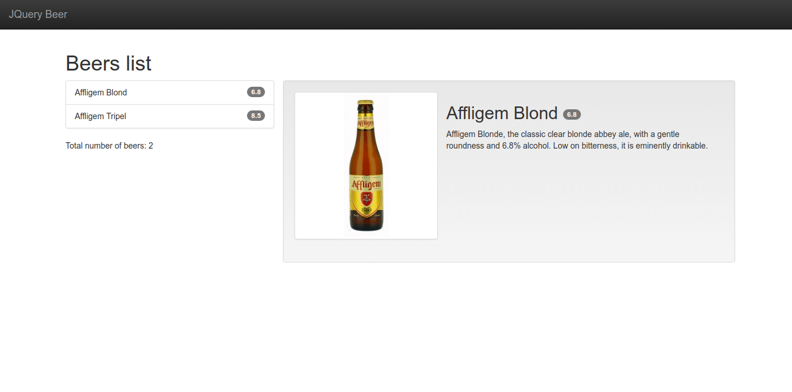

# TP2 : Liste des bières

Affichons la liste de nos bières de manière un peu plus dynamique.

## Etape 1

Créer une page `index.html` en s'inspirant du [Getting Started](http://getbootstrap.com/getting-started/) de Bootstrap
en utilisant les CDN, avec :

    <!DOCTYPE html>
    <html>
        <head>
            <meta charset="utf-8">
            <meta http-equiv="X-UA-Compatible" content="IE=edge">
            <meta name="viewport" content="width=device-width, initial-scale=1">
            <title>JQuery Beer</title>

            <!-- Bootstrap -->
            <!-- Latest compiled and minified CSS -->
            <link rel="stylesheet" href="https://maxcdn.bootstrapcdn.com/bootstrap/3.3.7/css/bootstrap.min.css"
                  integrity="sha384-BVYiiSIFeK1dGmJRAkycuHAHRg32OmUcww7on3RYdg4Va+PmSTsz/K68vbdEjh4u" crossorigin="anonymous">

            <!-- Optional theme -->
            <link rel="stylesheet" href="https://maxcdn.bootstrapcdn.com/bootstrap/3.3.7/css/bootstrap-theme.min.css"
                  integrity="sha384-rHyoN1iRsVXV4nD0JutlnGaslCJuC7uwjduW9SVrLvRYooPp2bWYgmgJQIXwl/Sp" crossorigin="anonymous">

            <!-- HTML5 shim and Respond.js for IE8 support of HTML5 elements and media queries -->
            <!-- WARNING: Respond.js doesn't work if you view the page via file:// -->
            <!--[if lt IE 9]>
            
            
            <![endif]-->
        </head>
        <body>
            

                <h1>Hello, world!</h1>
            

            <!-- jQuery (necessary for Bootstrap's JavaScript plugins) -->
            
            <!-- Include all compiled plugins (below), or include individual files as needed -->
            
        </body>
    </html>

## Etape 2

Ajoutons une [NavBar](http://getbootstrap.com/components/#navbar-fixed-top) statique
en couleur inversées avec un nom (*brand*) maais aucun lien.

A ce stade il va falloir customiser un peu notre page pour décaller le contenu avec de css, donc créer un fichier `style.css` et l'inclure dans le fichier `index.html` en y mettant :

    body { padding-top: 70px; }

Ajoutons une [list-group](http://getbootstrap.com/components/#list-group) décrivant les bières :

    

        <h1>Beers list</h1>
         <ul class="list-group">
             <li class="list-group-item">6.8 Affligem Blond</li>
             <li class="list-group-item">8.5 Affligem Tripel</li>
         </ul>
        
Total number of beers: 2

    

## Etape 3

Utilisons le [grid-system](http://getbootstrap.com/css/#grid) pour faire notre mise en page :

    

        

        

            <h2>Affligem Blond 6.8</h2>
            
Affligem Blonde, the classic clear blonde abbey ale, with a gentle roundness and 6.8% alcohol. Low on bitterness, it is eminently drinkable.

        

    

Vous devriez avoir ce résultat :

